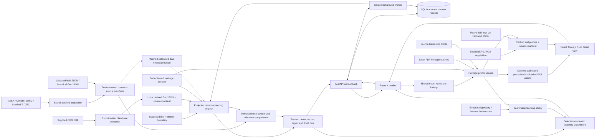

# Application architecture

## API contracts

The solid connections above are implemented. Dashed connections show planned dual-timescale research work, not an active or validated ML pipeline. Site-level SoilGrids context does not change existing run scores or their evidence assessment. See [Heritage and library contracts](HERITAGE_LIBRARY.md) for new endpoints, schemas, sources and limits.

| Endpoint | Purpose |
| --- | --- |
| `GET /api/health` | Service identity and health |
| `GET /api/catalog` | Current dataset inventory, persisted to SQLite |
| `GET /api/boundary` | WGS84 district geometry |
| `GET /api/sites` | Deduplicated heritage context without derived results |
| `GET /api/layers/water` or `/landuse` | Simplified display geometry; original geometry used in analysis |
| `POST /api/runs` | Validate parameters and enqueue one run; 409 if busy |
| `GET /api/runs` | Recent history without report bodies |
| `GET /api/runs/{id}` | State, progress, error and completed report |
| `GET /api/runs/{id}/cell?lat=...&lng=...` | Sample that run's raster at a location |
| `GET /api/runs/{id}/artifacts/{name}` | Allowlisted artifacts from completed runs only |

Run parameters: `resolution_m` in `[100,250,500]`, `slope_weight` from `0.1` to `0.9`. The browser polls active runs and switches off polling on completion. History selection never substitutes results from a different run. API failures appear visibly in the workspace.

## Run lifecycle

`queued → running → completed` or `failed`. Each state update is committed to SQLite. Startup marks interrupted work failed so users can retry with a new run. A SQLite partial unique index prevents two active records. A single local process owns a one-thread executor; do not run multiple API workers against this database. CLI initialization does not reset active jobs.

## Geographical correctness

- Original files are immutable inputs. Extracted PBF geometries are assembled, validated and clipped to the supplied district.
- Explicit water tags select water bodies and channels; unrelated natural features are excluded.
- Elevation is reprojected to EPSG:32644 before taking gradients; original numeric NoData becomes NaN.
- Arrays use north-up rows and columns with pixel-centre conventions. Invalid neighbours invalidate slope/score, rather than creating artificial cliffs.
- Outputs share one grid. GeoTIFF bands contain elevation, slope, relative lower position, terrain score, mapped-water distance, terrain class, and integrated evidence class. NoData is -9999; class codes 1/2/3/4 mean low/moderate/high/insufficient.
- Display rasters are separately reprojected to EPSG:4326 before applying browser bounds, and rendered without smoothing between categorical cells.
- Vector zones are clipped to the district; cell counts use centre inclusion. Downloaded GeoJSON uses WGS84.

## Reproduction and limitations

Every report stores parameters, method version, data catalogue snapshot, source/code/dependency hashes, exclusions, score thresholds and sensitivity. The extraction manifest additionally records PBF hash, header timestamp and rejected-geometry count. No old mock report is loaded by the API.

The PBF-derived water geometry can provide proximity context, but its mapping date does not establish observed seasonal water. Public rainfall, soil predictions, dated satellite indices and satellite-era water history are available as context. Measured infiltration, independently dated palaeochannels and storage/archaeological field outcomes are still missing; the integrated decision map remains insufficient data. Environmental context rasters have a separate fixed 250 m grid, with individual geographic bounds; reference comparison reprojects to the run grid. New runs save seasonal rasters and versioned comparison outputs, and older runs are never silently recomputed. See [environmental contracts](ENVIRONMENTAL_EVIDENCE.md). A complete research model needs the milestones in `RESEARCH_ROADMAP.md`.
